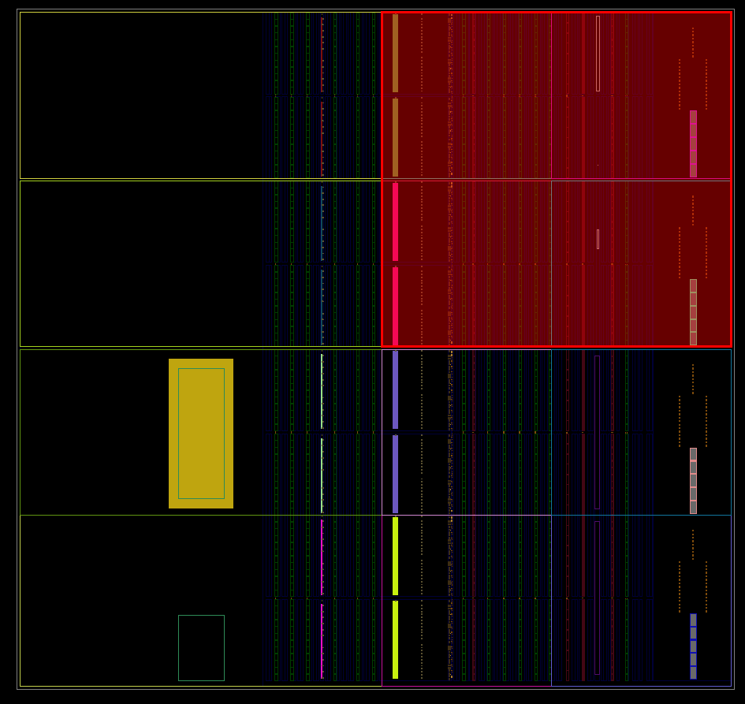
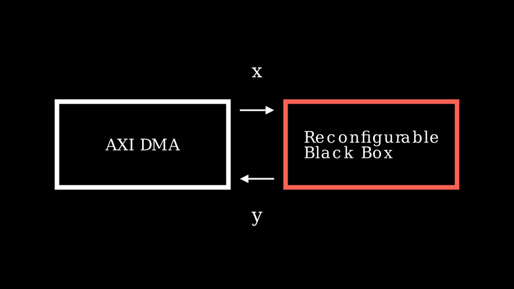
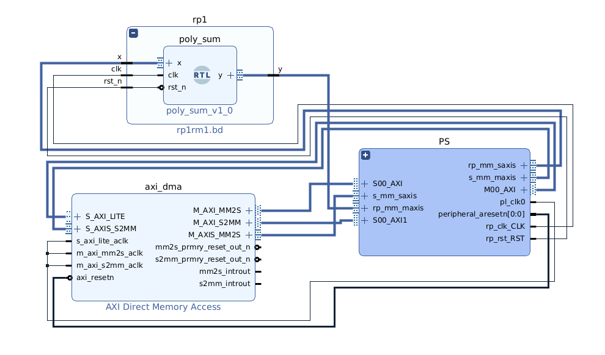
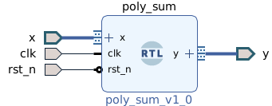
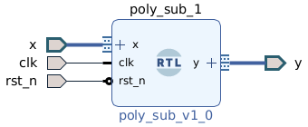

# Tutorial: Partial Reconfiguration with pynq-pr

## What is Partial Reconfiguration?

Partial Reconfiguration (PR) is a feature of FPGAs that allows you to dynamically reprogram a portion of the FPGA fabric while the rest of the device continues running without interruption.

To enable PR, the design must establish a clear boundary between the static region, which remains operational, and the reconfigurable region, which can be dynamically reprogrammed at runtime.



The red region in the floorplan becomes a collection of LUTs, DSPs, RAMs and other resources that can be used to design logic that can be reconfigured dynamically without affecting logic in the static region.

From the perspective of the static region, the reconfigurable region behaves like a black box: it has a fixed interface, receives input signals, and produces output signals. The internal functionality of this region can change dynamically, but as long as it adheres to the expected interface, the static logic can continue operating without modification.



Inside this black box, designers can define multiple reconfigurable modules (RMs), each implementing different functionality, as long as all modules conform to the same interface.

## Block Design Containers

Any modern PR flow in Vivado uses something called a Block Design Container (BDC). It adds a hierarchy to the flow so that each block design can be independently developed and later used as a reconfigurable module.

In pynq-pr, after running the build flow, the block design looks like this:



- `rp1`: name of the Block Design Container (`partition_name` in your config)
- `add_inst_0`: the BD instance inside `rp1` (`cell_name` + `_inst_0`)
- `poly_sum`: the top Verilog module (`top` in your config)

From the perspective of the static region, `rp1` is just a black box with a fixed port interface. For `rp1` to be treated as a reconfigurable partition, the property `ENABLE_DFX` must be set:

```tcl
set_property -dict [list CONFIG.ENABLE_DFX {true}] [get_bd_cells rp1]
```

This also shows up in the `.hwh` file for the static region:

```xml
<MODULE BDTYPE="BLOCK_CONTAINER" FULLNAME="/rp1" INSTANCE="rp1">
  <PARAMETER NAME="LOCK_PROPAGATE" VALUE="true"/>
  <PARAMETER NAME="ENABLE_DFX" VALUE="true"/>
```

Notice how the HWH knows `rp1` exists but not its contents. Those are described by the partial HWH files.

## Reconfigurable Modules

The BDC can hold as many reconfigurable modules as needed. Each RM is an independent block design with the same interface as `rp1`. For the bundled tutorial, there are two:

 

Each RM produces its own `.bit` and `.hwh` file. At the end of the build you get:

```
output/tutorial_z1/
├── bits/
│   ├── tutorial_z1.bit   # static bitstream
│   ├── tutorial_z1.hwh
│   ├── add.bit           # partial bitstream for poly_sum
│   ├── add.hwh
│   ├── sub.bit           # partial bitstream for poly_sub
│   └── sub.hwh
└── timing/
    ├── timing_add.txt
    └── timing_sub.txt
```

## How PYNQ Handles Partial Reconfiguration

The `Overlay` class comes with a method `pr_download()` for partial reconfiguration. When an overlay is created, it already knows about the `rp1` hierarchy even though no partial bitstream has been loaded yet:

```python
from pynq import Overlay
overlay = Overlay("tutorial_z1.bit")
dir(overlay.rp1)
```

To load a partial bitstream:

```python
overlay.pr_download("rp1", "add.bit")
```

This internally creates a `Bitstream` object, parses the corresponding `.hwh` file, and updates PL state. To swap to a different module at runtime:

```python
overlay.pr_download("rp1", "sub.bit")
```

The static region keeps running throughout. Only `rp1` is reprogrammed.


