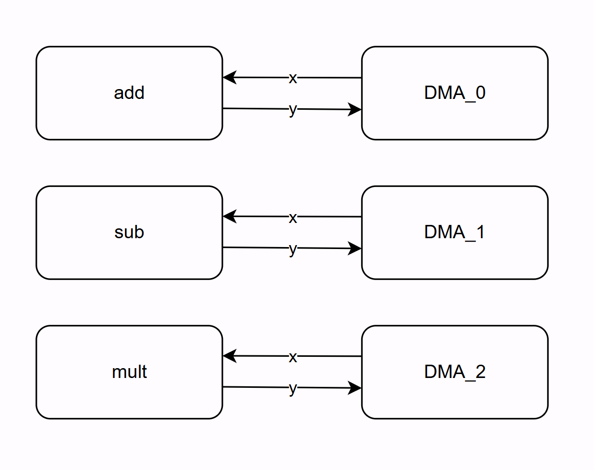
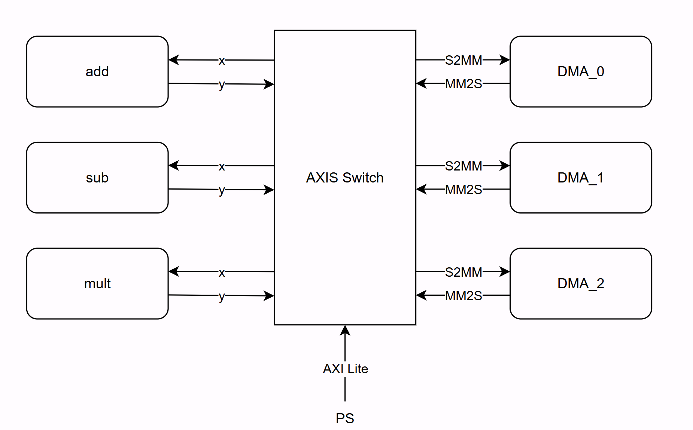
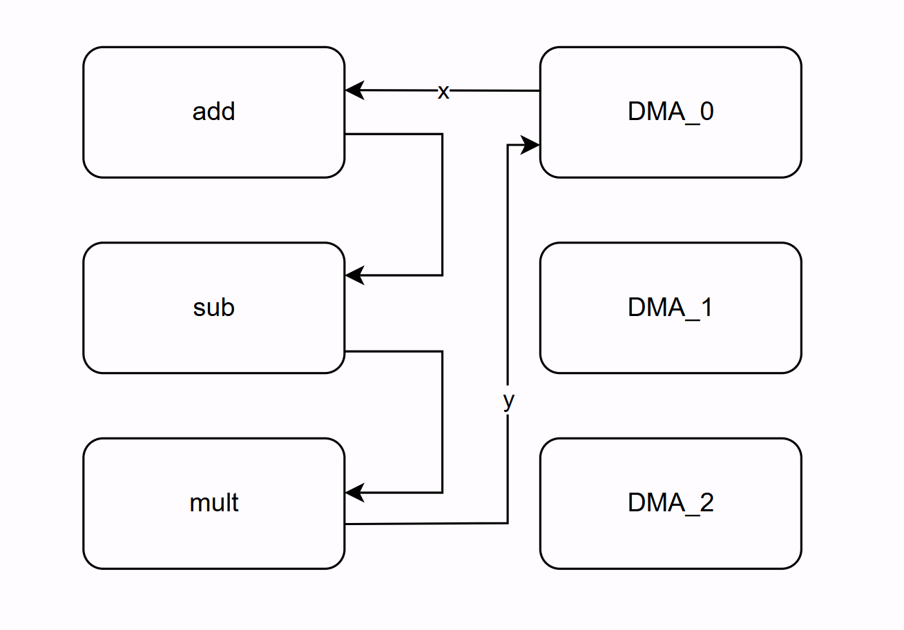

# Add/Sub Example

Three independent reconfigurable partitions (`add`, `sub`, `mult`), each with polynomial module variants. Demonstrates the multi-RP DFX flow with per-partition reconfiguration and runtime pipeline routing via AXI4-Stream Switch.

- `add` partition: `poly_sum` with `CONST=5` or `CONST=10`
- `sub` partition: `poly_sub` with `CONST=3` or `CONST=7`
- `mult` partition: `poly_mult` with `CONST=10`

## Two Modes

- `pynq-pr sim`: runs the design in cocotb/cocotbpynq simulation
- `pynq-pr build`: generates hardware bitstreams for deployment to a board

## Simulation

Run the full example in cocotb/cocotbpynq with the same Python test script used for the board flow:

```bash
cd examples/add_sub
pynq-pr sim -c pr_z1.yaml --test pr_test.py -f
```

This command:

- does not require a prior `pynq-pr build`
- generates `sim/tutorial_z1/pr_sim.yaml`
- auto-generates the simulation static region RTL
- builds the cocotbpynq/Verilator model
- runs the cocotb test in [pr_test.py](pr_test.py)

The test uses the same high-level `Overlay` and `Overlay.chain()` API in both modes. The only difference is the import block at the top of the script:

```python
COCOTB_IS_RUNNING = "COCOTB_SYS_ARGV" in os.environ

if not COCOTB_IS_RUNNING:
    import argparse
    from pynq import allocate
    from overlay import Overlay
else:
    import cocotbpynq
    from pynq_pr.overlay_sim import Overlay, allocate
```

If you only want a quick smoke test of independent partitions, you can also run:

```bash
pynq-pr sim -c pr_z1.yaml --test pr_min_test.py -f
```

## What it does

The test sends `[0, 1, ..., 15]` through the partition DMAs and verifies the result against the expected transform. Both the board-side overlay and the simulation overlay provide the same high-level routing API.

**Independent**

Each partition is reconfigured and tested on its own. Data flows `DMA -> RP -> DMA`.



```
=== Independent ===
  add/add_c_5:   [5, 6, 7, 8, 9, 10, 11, 12, 13, 14, 15, 16, 17, 18, 19, 20]  [PASS]
  add/add_c_10:  [10, 11, 12, 13, 14, 15, 16, 17, 18, 19, 20, 21, 22, 23, 24, 25]  [PASS]
  sub/sub_c_3:   [-3, -2, -1, 0, 1, 2, 3, 4, 5, 6, 7, 8, 9, 10, 11, 12]  [PASS]
  sub/sub_c_7:   [-7, -6, -5, -4, -3, -2, -1, 0, 1, 2, 3, 4, 5, 6, 7, 8]  [PASS]
  mult/mult_c_10: [0, 10, 20, 30, 40, 50, 60, 70, 80, 90, 100, 110, 120, 130, 140, 150]  [PASS]
```

**Chained (requires `axis_switch: true`)**

When the design includes an AXI4-Stream Switch, partitions can be pipelined.

 Data flows from the first partition's DMA, through each RP in order, and back to the first partition's DMA. The switch is configured by `ol.chain()`, just pass the partition names in order.

```python
ol.add.download("add_c_5.bit")
ol.sub.download("sub_c_3.bit")
ol.mult.download("mult_c_10.bit")
dma = ol.chain(["add", "sub", "mult"])   # DMA_add -> add -> sub -> mult -> DMA_add
```

For example, `ol.chain(["add", "sub", "mult"])` collapses the switch to this equivalent routing:



The test runs all pairwise and 3-way permutations automatically. Order matters when the operations don't commute (e.g. `add -> mult` gives `(x+5)*10`, while `mult -> add` gives `x*10+5`):

```
=== Chains ===
  chain(add_c_5, sub_c_3):              [2, 3, 4, ...]   (x+5-3 = x+2)      [PASS]
  chain(add_c_5, mult_c_10):            [50, 60, 70, ...]  ((x+5)*10)        [PASS]
  chain(sub_c_3, add_c_5):             [2, 3, 4, ...]   (x-3+5 = x+2)      [PASS]
  chain(sub_c_3, mult_c_10):            [-30, -20, -10, ...]  ((x-3)*10)     [PASS]
  chain(mult_c_10, add_c_5):            [5, 15, 25, ...]   (x*10+5)          [PASS]
  chain(mult_c_10, sub_c_3):            [-3, 7, 17, ...]   (x*10-3)          [PASS]
  chain(add_c_5, sub_c_3, mult_c_10):  [20, 30, 40, ...]  ((x+2)*10)        [PASS]
  chain(add_c_5, mult_c_10, sub_c_3):  [47, 57, 67, ...]  ((x+5)*10-3)      [PASS]
  chain(sub_c_3, add_c_5, mult_c_10):  [20, 30, 40, ...]  ((x+2)*10)        [PASS]
  chain(sub_c_3, mult_c_10, add_c_5):  [-25, -15, -5, ...]  ((x-3)*10+5)    [PASS]
  chain(mult_c_10, add_c_5, sub_c_3):  [2, 12, 22, ...]  (x*10+2)           [PASS]
  chain(mult_c_10, sub_c_3, add_c_5):  [2, 12, 22, ...]  (x*10+2)           [PASS]
```

## Build And Deploy

Generate board bitstreams with:

```bash
cd examples/add_sub
pynq-pr build -c pr_z1.yaml
```

Use `--force` to overwrite an existing output directory.

Then deploy and run the same Python script on hardware:

```bash
./deploy.sh -b z1 --test pr_test.py bits
./deploy.sh -b z1 --test pr_test.py run
./deploy.sh -b z1 --test pr_test.py all
```

Use `-b kv260` for the KV260. Set `BOARD_IP` to override the default target address.

On hardware, the board-side [overlay.py](../../pynq_pr/overlay.py) driver is copied alongside the test script. That overlay handles decoupling, ICAP/PCAP reconfiguration, and AXI-Stream switch routing, so [pr_test.py](pr_test.py) can run in both simulation and deployment with the same test logic.
