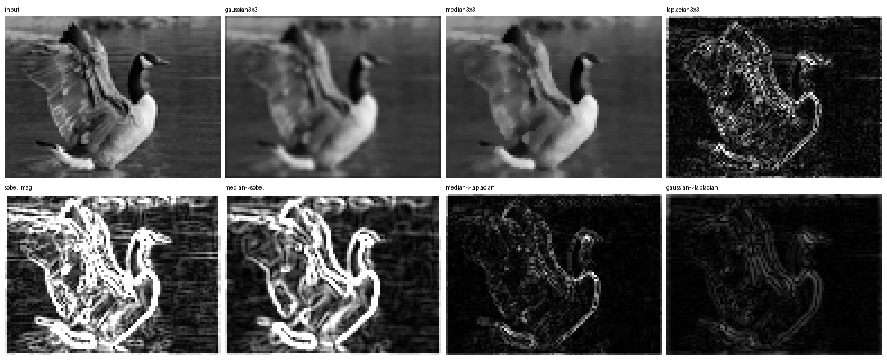

# Vision Example

Two reconfigurable partitions connected through an AXI4-Stream switch:

- `rp0`: smoothing stage, reconfigured between `gaussian3x3` and `median3x3`
- `rp1`: edge stage, reconfigured between `laplacian3x3` and `sobel_mag`

The combined example in [`pr_z1.yaml`](pr_z1.yaml) and
[`pr_kv260.yaml`](pr_kv260.yaml) forms a small image-processing pipeline:

```text
DMA(rp0) -> rp0/(gaussian3x3 or median3x3) -> rp1/(laplacian3x3 or sobel_mag) -> DMA(rp0)
```

Each RTL module uses the same shell interface as the other examples:

- AXI4-Stream input: `x_*`
- AXI4-Stream output: `y_*`
- AXI-Lite control: `s_axi_AXILiteS_*`
- clock/reset: `clk`, `rst_n`

Pixels are sent as one 8-bit grayscale value in the low byte of each 32-bit
AXI4-Stream word. The test programs `rows` and `cols` through AXI-Lite before
starting each filter.

## Two Modes

- `pynq-pr sim`: cocotb/cocotbpynq simulation
- `pynq-pr build`: hardware bitstream generation for board deployment

## Simulation

Run the full example with:

```bash
cd examples/vision
pynq-pr sim -c pr_z1.yaml --test pr_test.py -f
```

This command:

- generates `sim/vision_z1/pr_sim.yaml`
- auto-generates the simulation static region RTL
- builds the cocotbpynq/Verilator model
- runs the same [`pr_test.py`](pr_test.py) used for hardware
- writes image results under [`visual_artifacts/`](visual_artifacts/)

`pr_test.py` uses the same high-level overlay API as hardware. The chained
pipeline call is:

```python
dma = ol.chain(["rp0", "rp1"])
```

The test then:

1. verifies each filter as an independent `DMA -> RP -> DMA` path
2. verifies dynamic `rows` and `cols` AXI-Lite programming
3. verifies chained paths such as `median3x3 -> sobel_mag`
4. compares RTL/cocotb-pynq image outputs against Python reference images

The visual output below is generated by the cocotb-pynq run:



To skip image generation and run only the numeric smoke tests:

```bash
VISION_SKIP_VISUAL=1 pynq-pr sim -c pr_z1.yaml --test pr_test.py -f
```

To use a different input image:

```bash
VISION_VISUAL_SOURCE=/path/to/image.png pynq-pr sim -c pr_z1.yaml --test pr_test.py -f
```

## Python API

The test uses the same import pattern as the other examples:

```python
COCOTB_IS_RUNNING = "COCOTB_SYS_ARGV" in os.environ

if not COCOTB_IS_RUNNING:
    import argparse
    from pynq import MMIO, allocate
    from overlay import Overlay
else:
    import cocotbpynq
    from pynq_pr.overlay_sim import Overlay, allocate
```

That lets the same test logic run in both simulation and deployment.

## Build And Deploy

Generate board bitstreams with:

```bash
cd examples/vision
pynq-pr build -c pr_z1.yaml
pynq-pr build -c pr_kv260.yaml
```

Use `--force` to overwrite an existing output directory.

Then deploy and run the same Python script on hardware:

```bash
./deploy.sh -b z1 bits
./deploy.sh -b z1 run
./deploy.sh -b z1 all
```

Use `-b kv260` for the KV260. Set `BOARD_IP` to override the default target
address.

`deploy.sh` copies:

- the full bitstream and HWH
- all partial bitstreams and HWH files for `rp0` and `rp1`
- `.bin` partials when the config uses ICAP
- the board-side [`overlay.py`](../../pynq_pr/overlay.py)
- [`pr_test.py`](pr_test.py), [`visual.py`](visual.py), and the input image

Manual hardware runs after deployment:

```bash
python3 pr_test.py --project vision_z1
python3 pr_test.py --project vision_z1 --no-visual
python3 pr_test.py --project vision_z1 --visual-source /tmp/goose.jpeg
```

For KV260, use `--project vision_kv260`.

## Video Pipeline Mode

[`video_test.py`](video_test.py) extends the single-image test with a sustained
video workload that processes multiple frames, exercises mid-stream partial
reconfiguration, and produces timing data for paper figures.

It runs four tests:

1. **Independent gaussian/laplacian** — each RP in isolation over a video clip
2. **Independent median/sobel** — same structure, Config B modules
3. **Chained median->sobel** — two-stage pipeline over a full clip
4. **Mid-stream swap** — starts with gaussian+laplacian chained, swaps both RPs
   to median+sobel at a configurable frame, verifies every frame across the swap

**Simulation (quick correctness check):**

```bash
cd examples/vision
pynq-pr sim -c pr_z1.yaml --test video_test.py -f
```

**Simulation with custom frame size:**

```bash
VIDEO_FRAMES=20 VIDEO_ROWS=64 VIDEO_COLS=80 \
  pynq-pr sim -c pr_z1.yaml --test video_test.py -f
```

**Skip visual gallery output:**

```bash
VIDEO_SKIP_VISUAL=1 pynq-pr sim -c pr_z1.yaml --test video_test.py -f
```

**Hardware (Z1):**

```bash
python3 video_test.py --project vision_z1 --icap
python3 video_test.py --project vision_z1 --icap --frames 100 --rows 480 --cols 640
```

**Deploy and run via deploy.sh:**

```bash
./deploy.sh -b z1 --test video_test.py run
./deploy.sh -b z1 --test video_test.py --no-visual all
```

`deploy.sh` automatically uploads `pr_test.py` alongside `video_test.py`
(needed for the reference functions import).

**Configuration knobs** (env vars for simulation, CLI args for hardware):

| Purpose | Env var | CLI arg | Sim default | HW default |
|---|---|---|---|---|
| Number of frames | `VIDEO_FRAMES` | `--frames` | 6 | 30 |
| Frame height | `VIDEO_ROWS` | `--rows` | 16 | 240 |
| Frame width | `VIDEO_COLS` | `--cols` | 32 | 320 |
| Swap frame index | `VIDEO_SWAP_FRAME` | `--swap-frame` | n_frames/2 | n_frames/2 |
| Skip visual gallery | `VIDEO_SKIP_VISUAL` | `--no-visual` | false | false |
| Skip timing CSV | `VIDEO_SKIP_TIMING` | `--no-timing` | false | false |
| Output directory | `VIDEO_ARTIFACT_DIR` | `--artifact-dir` | video_artifacts | video_artifacts |
| Real video frames | `VIDEO_SOURCE_DIR` | `--source-dir` | "" (synthetic) | "" (synthetic) |

**Frame size limits:** The DMA BTT register supports up to 2^26 = 64 MB per
transfer. At 4 bytes/pixel (32-bit AXI-Stream), the maximum frame size is
16M pixels — 1920x1080 (8.3 MB) and even 3840x2160 (33 MB) fit comfortably.
The practical ceiling is the board's CMA region (128-256 MB on Z1). Frame count
is unlimited since buffers are pre-allocated and reused.

**Timing output:** Per-frame DMA transfer times and swap latency are written to
`video_artifacts/timing.csv`. Use `--no-timing` to skip.

**Build-vs-simulation figure:** Recreate the normalized CSV and plot with one
command from `examples/vision`:

```bash
python3 scripts/plot_video_build_vs_sim.py
```

That command writes:

- `scripts/output/video_build_vs_sim.csv`
- `build_timing/video/build_vs_sim.png`
- `build_timing/video/build_vs_sim.pdf`

The plot is generated from the single CSV, whose schema is:

```csv
bar,bar_order,segment,segment_order,seconds,source
```

If the raw timing data moves, point the same script at the new inputs; relative
paths are resolved from `examples/vision`:

```bash
python3 scripts/plot_video_build_vs_sim.py \
  --build-timing-dir build_timing/<stamp> \
  --video-timing-dir build_timing/video \
  --video-frame-timing-csv video_artifacts/timing.csv
```

To replot from the saved CSV only:

```bash
python3 scripts/plot_video_build_vs_sim.py --from-csv
```

**Real video input:** Pre-extract frames with ffmpeg and point `--source-dir`
at them:

```bash
ffmpeg -i input.mp4 -vf "scale=320x240,format=gray" frames/frame_%04d.png
python3 video_test.py --project vision_z1 --icap --source-dir frames/
```
